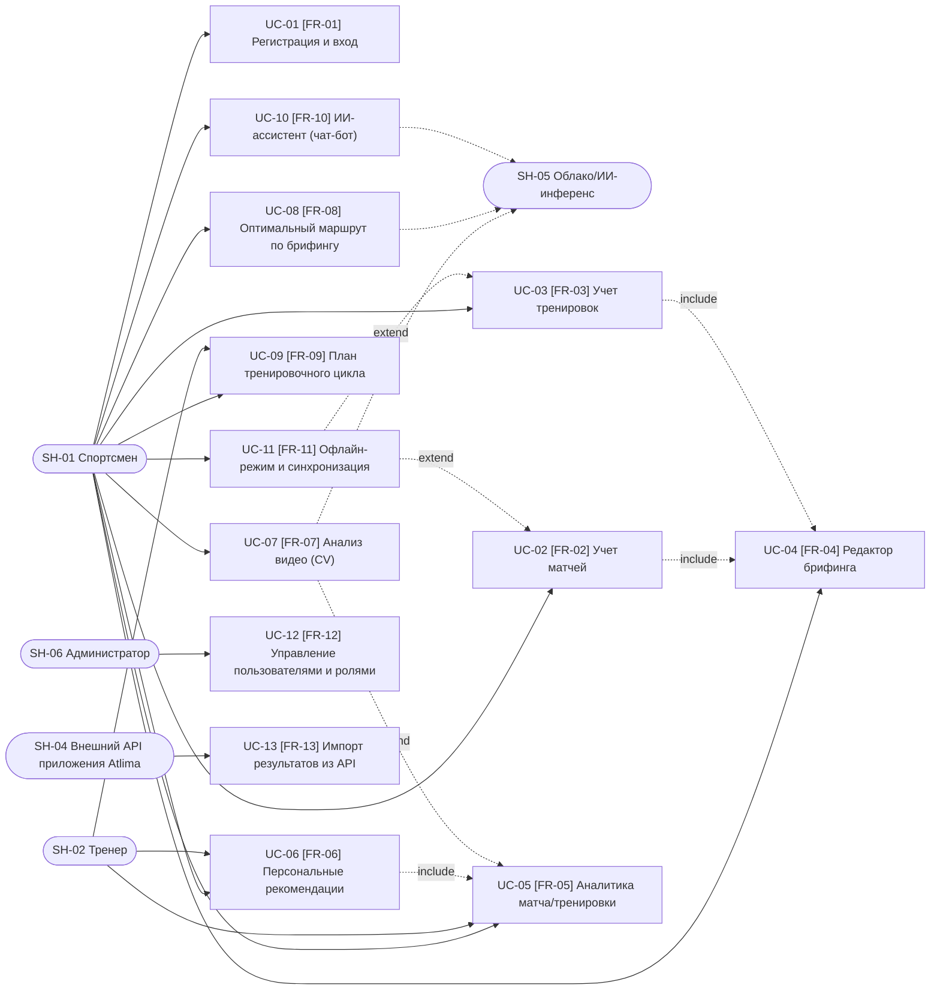

```mermaid
flowchart LR
    %% Акторы
    SP([SH-01 Спортсмен])
    TR([SH-02 Тренер])
    AD([SH-06 Администратор])
    EXT1([SH-04 Внешний API приложения Atlima])
    EXT2([SH-05 Облако/ИИ-инференс])

    %% Use Cases
    UC01["UC-01 [FR-01] Регистрация и вход"]
    UC02["UC-02 [FR-02] Учет матчей"]
    UC03["UC-03 [FR-03] Учет тренировок"]
    UC04["UC-04 [FR-04] Редактор брифинга"]
    UC05["UC-05 [FR-05] Аналитика матча/тренировки"]
    UC06["UC-06 [FR-06] Персональные рекомендации"]
    UC07["UC-07 [FR-07] Анализ видео (CV)"]
    UC08["UC-08 [FR-08] Оптимальный маршрут по брифингу"]
    UC09["UC-09 [FR-09] План тренировочного цикла"]
    UC10["UC-10 [FR-10] ИИ-ассистент (чат-бот)"]
    UC11["UC-11 [FR-11] Офлайн-режим и синхронизация"]
    UC12["UC-12 [FR-12] Управление пользователями и ролями"]
    UC13["UC-13 [FR-13] Импорт результатов из API"]

    %% Связи акторов
    SP --> UC01
    SP --> UC02
    SP --> UC03
    SP --> UC04
    SP --> UC05
    SP --> UC06
    SP --> UC07
    SP --> UC08
    SP --> UC09
    SP --> UC10
    SP --> UC11
    TR --> UC05
    TR --> UC06
    TR --> UC09
    AD --> UC12
    EXT1 --> UC13
    UC07 -.-> EXT2
    UC08 -.-> EXT2
    UC10 -.-> EXT2

    %% include / extend
    UC02 -. include .-> UC04
    UC03 -. include .-> UC04
    UC06 -. include .-> UC05
    UC07 -. extend .-> UC05
    UC11 -. extend .-> UC02
    UC11 -. extend .-> UC03
```
